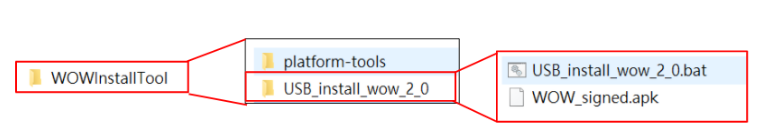

# WOW-APP2_Release  
1. 設備準備  
一台電腦 (可執行 adb)  
一台DN72  
一台螢幕   
一條OTG 線(USB3.0 或2.0皆可)  
一個滑鼠  
一條HDMI 線  

2. 軟體準備  
a. USB_install_wow_2_0.bat 請依據不同裝置取得不同安裝執行檔來執行操作  
以下步驟可依據自己手上的 .bat 檔做修改  
b. [WOW_signed.apk](https://github.com/Space4mDev/WOW_APP2_Release) 與 .bat 放在同一資料夾內  
c. 請依據 "安裝裝置" 選擇 檔案放置位置 USB_install_wow_2_0 或是 WiFi_install_wow_2_0 資料夾內     
  
  
3. 安裝流程  
a. 用 OTG 線 將 DN72 與電腦連接  
b. 滑鼠連接 DN72  
c. 開啟開發人員選項  
&nbsp;&nbsp;&nbsp;&nbsp;&nbsp;&nbsp;Android設定 > 關於手機 > 版本號碼 => 點擊 7 下  
&nbsp;&nbsp;&nbsp;&nbsp;&nbsp;&nbsp;Android設定 > 開發人員選項 > USB偵錯 => 開啟  
d. 在 裝置 開啟 USB 連線   
&nbsp;&nbsp;&nbsp;&nbsp;&nbsp;&nbsp;Android設定 > USB > 勾選 Connect to PC   
e. 點擊 .bat 檔案  
成功圖示：  
  
  
裝置將自動重啟並開啟 WOW APP 2.0  
  
4. bat 執行錯誤處理  
	a. 找不到裝置、裝置無法連線、裝置offline  
&nbsp;&nbsp;&nbsp;&nbsp;&nbsp;&nbsp;i. 重新連接 OTG 線 (3 - a)  
&nbsp;&nbsp;&nbsp;&nbsp;&nbsp;&nbsp;ii. 確認開發人員選項開啟 (3 - c)  
&nbsp;&nbsp;&nbsp;&nbsp;&nbsp;&nbsp;iii. 確認裝置USB 連線已開啟 (3 - d)  
	b. 找不到 WOW_signed.apk 檔案  
&nbsp;&nbsp;&nbsp;&nbsp;&nbsp;&nbsp;i.確認資料夾結構如 圖1-1  
	c. Permission Deny  
&nbsp;&nbsp;&nbsp;&nbsp;&nbsp;&nbsp;i.確認 adb tools 版本 (2-c)  
  
  
